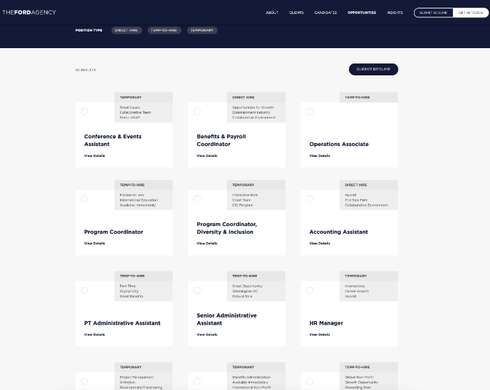
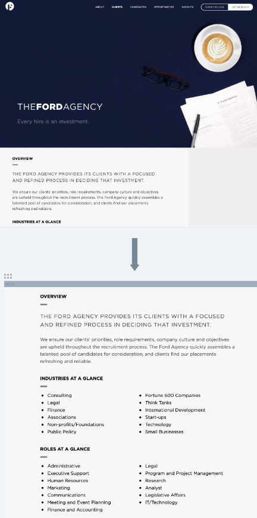

# Staffing Agency 

## Requirements

- [ ] Use a Rails API backend with a React frontend.
- [ ] Have at least three models on the backend, that include the following:
- [ ] At least two one-to-many relationships.
- [ ] At least one reciprocal many-to-many relationship (implemented by using 2 has-many-through relationships). Note: in order to accomplish this, your project must include a joins table. This joins table must include a user submittable attribute.
- [ ] Full CRUD actions for at least one resource.
- [ ] Minimum of create and read actions for EACH resource.
- [ ] Have at least three different client-side routes using React Router. Be sure to include a nav bar or other UI element that allows users to navigate between routes.
- [ ] Implement authentication/authorization, including password protection. A user must be able to:

- sign up with a new user account,
- log in to the site with a secure password and stay logged in via user ID in the session hash
- log out of the site

## User Stories

A user do the following upon visiting the site

- [ ] View a list of all available job opporunities
- [ ] View the general homepage and components
- [ ] Sign up for an account
- [ ] Log in to the site & remain logged in,
- [ ] Log out
- [ ] Submit a job application when logged in
- [ ] Set up an interview time when logged in
- [ ] Modify or delete resume uploads and interview times

